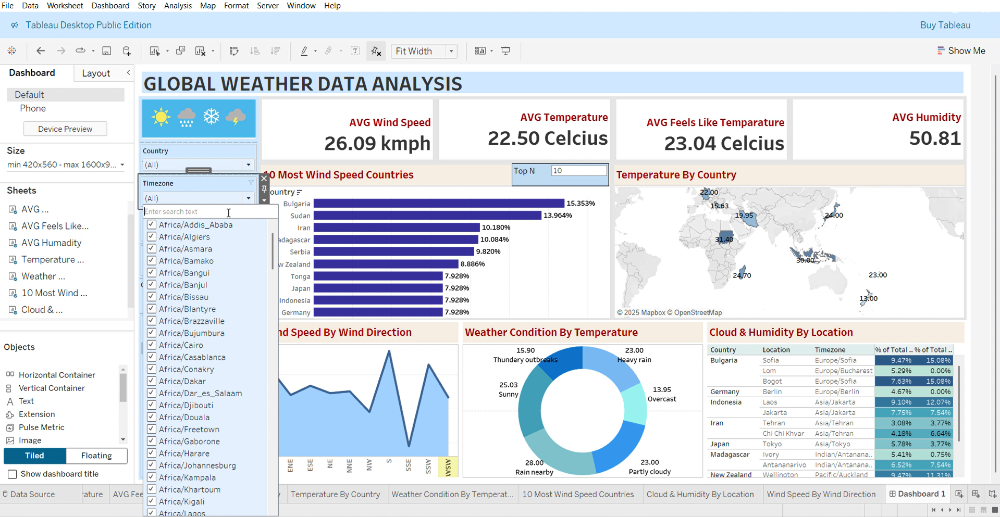

# global-weather-data-analysis-dashboard
A Tableau dashboard to visualize global weather data using charts and analysis


⛅ Global Weather Data Dashboard - Tableau Project



## 🌍 Project Overview

This Tableau dashboard visualizes global weather data to understand trends in temperature, humidity, wind speed, and weather conditions across different countries and locations. The dataset was sourced from Kaggle and cleaned before visualization.

The dashboard helps users explore:
- Highest wind speed countries
- Weather conditions and temperature patterns
- Humidity and cloud levels by region
- Interactive filters by country, timezone, and direction

---

## 📁 Dataset Details

- **Source**: [Kaggle - Global Weather Data](https://www.kaggle.com/)
- **Format**: CSV / Excel
- **Preprocessing**: 
  - Removed unwanted/missing rows
  - Cleaned column names

### 🔑 Key Columns Used:
- `Country`, `Location`, `Latitude`, `Longitude`, `Timezone`
- `Temperature (Celsius)`, `Feels like (Celsius)`, `Wind kmph`, `Wind Direction`, `Humidity`, `Cloud`
- `Condition`

---

## 📊 Visuals Created in Tableau

1. **N Most Windy Countries (Dynamic Bar Chart)**
   - Bar chart that changes based on a user-selected `N`
   - Rows: `Country`
   - Columns: `Wind speed`

2. **Temperature by Country** (Map)
   - Columns: `AVG(Longitude)`
   - Rows: `AVG(Latitude)`
   - Size/Color: `Temperature`

3. **Wind Speed by Direction** (Line Chart)
   - Columns: `Wind Direction`
   - Rows: `AVG(Wind kmph)`

4. **Weather Condition by Temperature** (Pie Chart)
   - Slices: `Weather Condition`
   - Values: `Temperature`

5. **Cloud & Humidity by Location** (Table)
   - Columns: `Measure Names`
   - Rows: `Country`, `Location`, `Timezone`

6. **Top Banner**
   - Title and weather-themed image added to header

---

## 📉 Metrics Displayed

- **AVG Wind Speed**
- **AVG Temperature**
- **AVG Feels Like Temperature**
- **AVG Humidity**

---

## 🔎 Filters Available

- `Country`
- `Location`
- `Timezone`
- `Wind Direction`

---

## 🖼️ Dashboard Screenshot

_The image above displays the complete Tableau weather dashboard with all charts, metrics, and filters._

---

## 📌 How to Use This Project

1. Clone the repo:
   ```bash
   git clone https://github.com/yourusername/global-weather-dashboard.git
Open the Tableau .twb or .twbx file in Tableau Desktop

Review visuals and filters, or connect your own data

📄 License
This project is provided for educational and portfolio use only. Check the Kaggle dataset license before reusing commercially.

🙋‍♀️ Author
**Dilsha Nethmini**  
📊 Business Analyst | 💡 Tableau & Power BI Explorer  
📍 Based in Sri Lanka  
🔗 [Connect with me on LinkedIn](www.linkedin.com/in/dilsha-de-silva-9554a6315)

